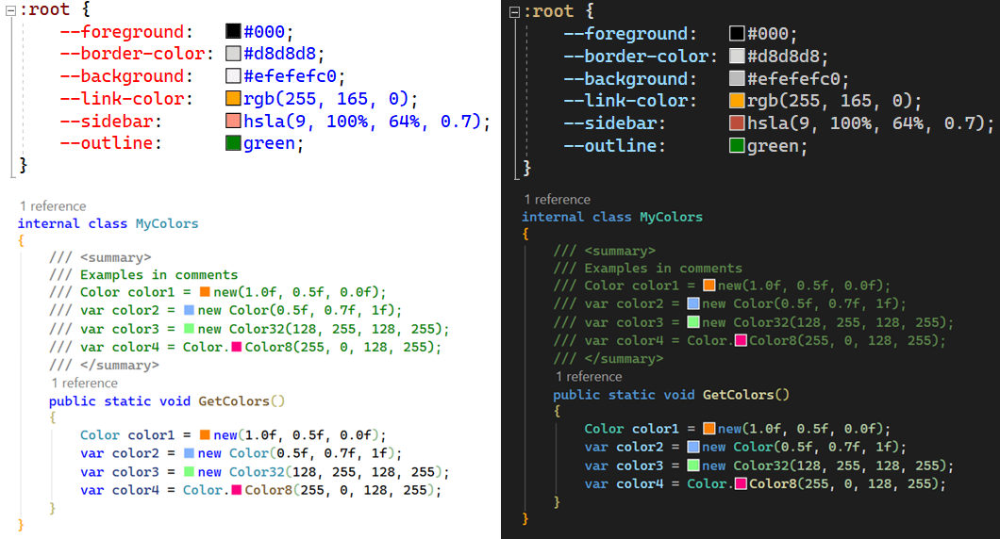

[upstream]: https://github.com/madskristensen/EditorColorPreview

# Color Preview for Visual Studio (Fork)

> **This is a fork of [EditorColorPreview][upstream] by [Mads Kristensen](https://github.com/madskristensen), licensed under the [Apache License 2.0](LICENSE).**

---

Shows a color preview in front of all named colors, hex, rgb and hsl values in CSS, JavaScript, and C# files.

 
**\*Figure 1**: Color preview in light theme and dark theme\*

## Changes from upstream

The following modifications were made to the original project:

- Added support for C# files (`[ContentType("CSharp")]`)
- Added color preview for C# color patterns: `new Color(r,g,b,a)`, `new Color32(r,g,b,a)`, target-typed `new(r,g,b,a)`, float variants, and any call with `Color`/`Color32` as the declared type (compatible with Unity, Godot, MonoGame, FNA, Raylib_cs)
- Added a dedicated regex for C# color matching (independent of the CSS `:` lookbehind, skips `//` comments)
- Updated `MatchesColor` to return `IEnumerable<Match>` combining results from both CSS and C# regex patterns

## Supported colors

These color formats are supported:

- Named colors (e.g. `blue`)
- Hex 3 digits (e.g. `#ff0`)
- Hex 6 digits (e.g. `#ffff00`)
- Hex 8 digits (e.g. `#ffff00cc`)
- RGB
  - `rgb(255, 165, 0)`
  - `rgb(0% 50% 0%)`
  - `rgb(0 128.0 0)`
  - `rgb(0% 50% 0% / 0.25)` (Alpha channel)
- RGBA (e.g.
  - `rgba(255, 165, 0)`
  - `rgba(0% 50% 0%)`
  - `rgba(0 128.0 0)`
  - `rgba(0% 50% 0% / 0.25)`
- HSL
  - `hsl(9, 100%, 64%)`
  - `hsl(120 100% 25%)`
  - `hsl(120deg 100% 25%)`
  - `hsl(120 100% 25% / 0.25)`
  - `hsl(120 none none)`
- HSLA
  - `hsla(9, 100%, 64%, 0.7)`
  - `hsla(120 100% 25%)`
  - `hsla(120deg 100% 25%)`
  - `hsla(120 100% 25% / 0.25)`
  - `hsla(120 none none)`
- HWB
  - `hwb(120 0% 49.8039%)`
  - `hwb(0 0% 100%)`
  - `hwb(0 100% 100%)`
  - `hwb(120 30% 50% / 0.5)`
  - `hwb(none none none)`
- Lab (Colors are converted to sRGB. Some colors might not convert properly) [^1]
  - `lab(46.2775% -47.5621 48.5837)`
  - `lab(100% 0 0)`
  - `lab(70% -45 0)`
  - `lab(86.6146% -106.5599 102.8717)`
- LCH (Colors are converted to sRGB. Some colors might not convert properly) [^1]
  - `lch(46.2775% 67.9892 134.3912)`
  - `lch(0% 0 0)`
  - `lch(50% 50 0)`
  - `lch(70% 45 -180)`
- OKLab (Colors are converted to sRGB. Some colors might not convert properly) [^1]
  - `oklab(51.975% -0.1403 0.10768)`
  - `oklab(0% 0 0)`
  - `oklab(100% 0 0)`
  - `oklab(50% 0.05 0)`
- OKLCH (Colors are converted to sRGB. Some colors might not convert properly) [^1]
  - `oklch(51.975% 0.17686 142.495)`
  - `oklch(0% 0 0)`
  - `oklch(100% 0 0)`
  - `oklch(50% 0.2 0)`
- C# / Raylib_cs / MonoGame / FNA / Unity / Godot (in .cs files)
  - `new Color(0, 128, 255, 200)`
  - `new Color(0, 128, 255)`
  - `new(0, 128, 255, 200)` (target-typed new)
  - `new Color(1.0f, 0.5f, 0.0f)` (float, 0.0–1.0 range)
  - `new Color(1.0f, 0.5f, 0.0f, 1.0f)`
  - `new Color32(128, 255, 128, 255)` (Unity Color32)
  - `Color.Color8(255, 0, 128, 255)` (Godot Color8)
  - `Color c = Rgba(11, 15, 26);` (any call when `Color` or `Color32` is the type)

[^1]: A color may be a valid color but still be outside the range of colors that can be produced by an output device (a screen, projector, or printer). It is said to be out of gamut for that color space.

## License

This project is licensed under the Apache License 2.0 — see the [LICENSE](LICENSE) file for details.

Original work copyright © [Mads Kristensen](https://github.com/madskristensen). Modified work as described above.